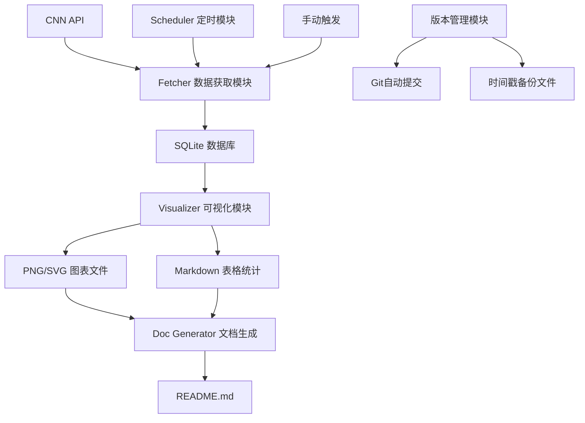

## 产品概述

优化现有的恐慌贪婪指数数据项目，建立完整的自动化更新系统，实现数据获取、可视化、文档生成和版本管理的一体化流程。

## 核心功能

- **数据获取与存储**：从CNN API获取最新数据，SQLite本地缓存
- **可视化图表生成**：PNG/SVG图片 + Markdown统计表格
- **文档自动更新**：README.md自动刷新图表和统计数字
- **版本历史管理**：Git自动提交 + 时间戳备份文件
- **定时与手动触发**：Python脚本内置定时器，支持手动运行

## 技术栈选择

- **语言**：Python 3.x
- **数据库**：SQLite（轻量级本地存储）
- **可视化**：Matplotlib + Pandas
- **定时任务**：schedule库（轻量级后台定时）
- **版本控制**：Git（自动提交脚本）

## 技术架构

### 系统架构



### 模块划分

1. **database.py**：SQLite数据库管理（创建表、增删改查）
2. **fetcher.py**：CNN API数据获取（优化现有fngindex.py逻辑）
3. **visualizer.py**：图表生成（趋势图、分布图、统计摘要）
4. **doc_generator.py**：README.md自动生成（模板+动态数据）
5. **version_control.py**：版本管理（Git提交、备份文件）
6. **scheduler.py**：定时任务调度
7. **main.py**：主控入口（整合所有模块，支持CLI参数）

## 实现细节

### 性能与可靠性

- **增量更新**：只获取数据库中最新日期之后的新数据，避免全量拉取
- **错误重试**：API请求失败时自动重试3次，间隔递增
- **数据校验**：检查数据范围(0-100)和日期连续性
- **备份策略**：每次更新前创建备份，保留最近10个版本

### 执行注意事项

- 复用现有fngindex.py的API调用逻辑，升级为模块化结构
- 使用现有fake_useragent策略绕过反爬
- SQLite文件放置在项目根目录，命名fng_data.db

## 目录结构

```
Fear_and_Greed_Index/
├── src/
│   ├── __init__.py           # [NEW] 包初始化
│   ├── database.py           # [NEW] SQLite数据库管理
│   ├── fetcher.py            # [NEW] CNN API数据获取
│   ├── visualizer.py         # [NEW] 图表生成模块
│   ├── doc_generator.py      # [NEW] README自动生成
│   ├── version_control.py    # [NEW] Git提交和备份管理
│   ├── scheduler.py          # [NEW] 定时任务调度
│   └── config.py             # [NEW] 配置常量
├── output/
│   ├── charts/               # [NEW] 生成的图表文件
│   └── backups/              # [NEW] 历史备份文件
├── main.py                   # [NEW] 主入口，支持CLI
├── fng_data.db               # [NEW] SQLite数据库
├── fngindex.py               # [MODIFY] 保留原脚本，标记为旧版
├── README.md                 # [MODIFY] 重写为结构化文档
├── requirements.txt          # [NEW] 依赖清单
├── fear-greed.csv            # [KEEP] 原始数据保留
└── all_fng_csv.csv           # [KEEP] 历史数据保留
```

## 关键代码结构

```python
# config.py - 核心配置
class Config:
    CNN_API_URL = "https://production.dataviz.cnn.io/index/fearandgreed/graphdata/"
    DB_PATH = "fng_data.db"
    CHARTS_DIR = "output/charts"
    BACKUPS_DIR = "output/backups"
    UPDATE_INTERVAL_HOURS = 24
    MAX_BACKUPS = 10

# database.py - 数据库接口
class FngDatabase:
    def init_db(self) -> None: ...
    def get_latest_date(self) -> datetime: ...
    def insert_records(self, records: List[FngRecord]) -> int: ...
    def get_stats(self) -> Dict: ...

# main.py - 主入口
def main():
    parser = argparse.ArgumentParser()
    parser.add_argument("--mode", choices=["auto", "manual", "once"])
    # auto: 后台定时运行, manual: 手动触发, once: 单次执行后退出
```

## 文档设计风格

采用简洁专业的技术文档风格，以清晰的层级结构展示项目信息，配合数据可视化图表增强可读性。

## README.md 结构设计

### 块1：项目标题与徽章

项目名称、状态徽章（数据更新时间、数据量、Python版本）

### 块2：项目简介

一句话描述项目用途，核心功能列表

### 块3：数据统计摘要

Markdown表格展示：最新指数、7日均值、30日均值、历史极值、当前情绪状态（恐惧/贪婪等级）

### 块4：趋势图表

嵌入生成的PNG/SVG图表：30日趋势图、年度分布直方图

### 块5：安装与使用

依赖安装命令、CLI使用方法、定时任务配置

### 块6：API说明

模块接口文档、配置项说明

### 块7：数据来源与更新

CNN数据源说明、更新频率、历史版本管理

### 块8：许可证

MIT License

## Agent Extensions

### SubAgent

- **code-explorer**
- Purpose: 探索现有代码模式和依赖关系，确保新模块与现有代码风格一致
- Expected outcome: 获取现有fngindex.py的完整调用链和数据流，指导新模块设计